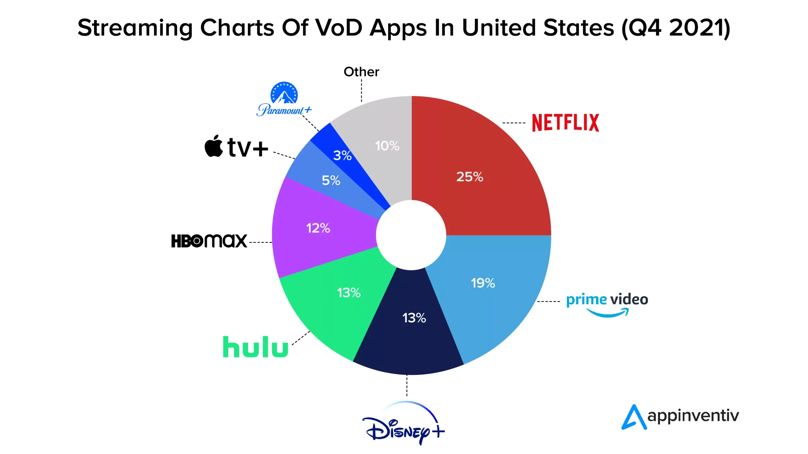
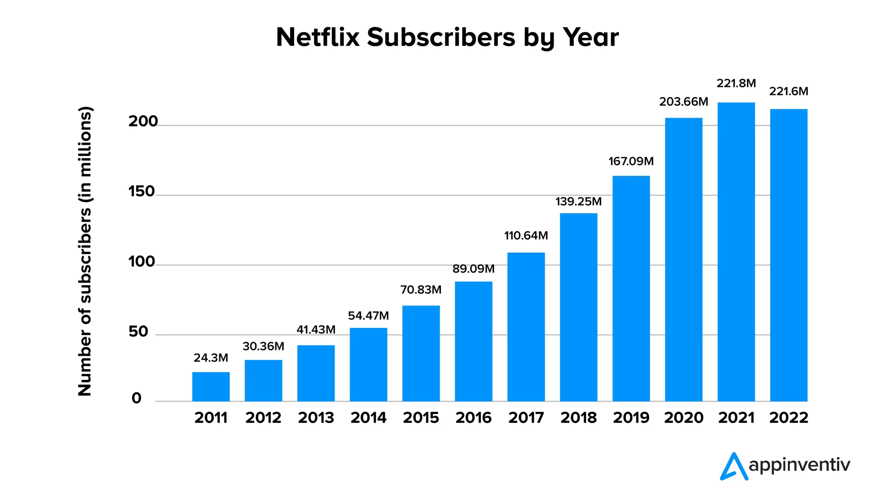

# Netflix

### Содержание
1. <a href="#description">Описание</a>
2. <a href="#sources">Ссылки на ресурсы</a>

## 1. Описание

Netflix стриминговый сервис для просмотра фильмов и сериалов с персональными рекомендациями для пользователей.

### Целевая аудитория

Возраст среднего пользователя 25-34 года (31% пользователей).

Распределение пользователей по полу: 54.40% - мужчины и 45.60% - женщины
| Статистика посещаемости | Количество |
| --- | --- |
| Количество пользователей с подпиской | <a href="https://s22.q4cdn.com/959853165/files/doc_news/Netflix-Releases-Fourth-Quarter-2022-Financial-Results-2023.pdf">223M</a> |
| Количество посещений за месяц | 1.8B |
| Средняя продолжитимость посещения сайта | 05m:12s |
| Среднее количество страниц за посещение | 4.42 |

<!-- | Количество посетителей сайта за месяц | --- |
| Количество посетителей сайта в день | --- | -->
<!-- https://appinventiv.com/blog/netflix-statistics-facts/ -->
| Распределение пользователей с подпиской по миру | Количество |
| --- | --- |
| США | 67.28M |
| Бразилия | 18.22M |
| Великобритания | 12.75M |
| Германия | 10.7M |
| Франция | 10.1M |
| Другие | 112.95M |

| Топ стран по посещаемости | % |
| --- | --- |
| США | 24 |
| Бразилия | 5.82 |
| Великобритания | 5.12 |
| Канада | 4.49 |
| Германия | 4 |
| Другие | 56.47 |

### MVP
- Регистрация и авторизация пользователей
- Публикация фильмов/сериалов
- Список рекомендация фильмов (самое популярное)
- Просмотр фильма
- Просмотр сериала
- Оценка фильма (лайк/дизлайк)

---
<a id="sources" href="https://appinventiv.com/blog/netflix-statistics-facts/">appinventiv</a>

<a href="https://s22.q4cdn.com/959853165/files/doc_news/Netflix-Releases-Fourth-Quarter-2022-Financial-Results-2023.pdf">Netflix Q4 2022 Financial Results</a>

<a href="https://www.similarweb.com/ru/website/netflix.com/#interests">Similar Web</a>